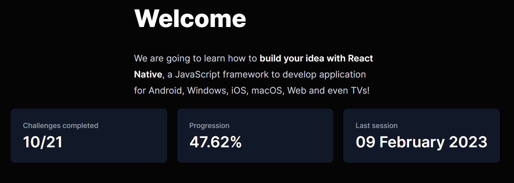

# Projet Météo de gulli

Ce projet est un projet fait en react native

## Authors

- [@gduquesne02](https://www.github.com/gduquesne02)

## Features

- Voir certaines données concernant la météo d'une ville partout dans le monde
- Si une personne rentre une mauvaise ville ou rien, l'application renvoi vers une page d'erreur
- Une photo conernant la ville rentré est affiché en bas (Certaines fois l'image est étrange 😂)

## Demo

## Progression du workshop

